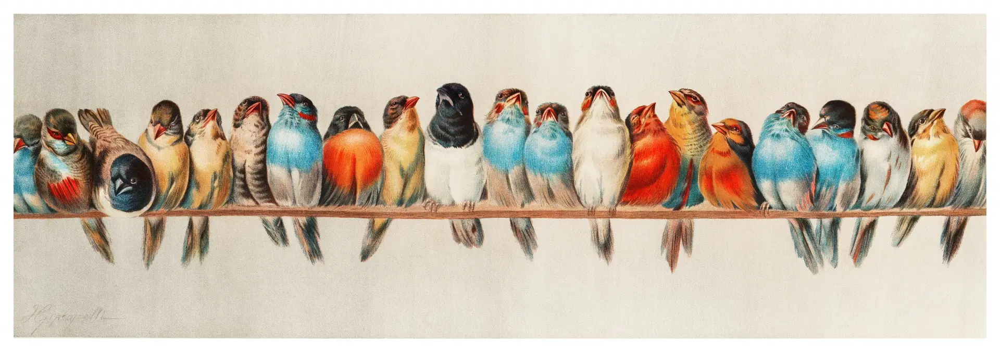

为了满足 <https://SCUTEEE.com>  的需求，Green-Magpie 新增了如下特性：

## Pop-up-once 消息框

`pop-up-once` 消息框会在页面加载完成后弹出，然后就会缩小到右上角，并且当读者往下滑时隐藏。用法是：

```text {filename="Markdown"}

这是一个 pop-up-once 示例。

```


这是一个 pop-up-once 示例。


这个每篇文章只能有一个，多个会出 bug。并且里面只能支持一般文字和链接，不支持过于复杂的 Markdown。

## Mathjax

Green-Magpie 引入了新的数学渲染库 `Mathjax`，可以在网站设置中选择。默认是 `KaTeX`.

```yaml {filename="hugo.yaml"}
params:
  math:
    renderer: mathjax # 默认: katex | 可选: mathjax/katex
```

此外，还对过宽的公式进行了优化。

## Alert

提示块（alert）是一种特殊的，带颜色的引用，在 [Hugo](https://gohugo.io/render-hooks/blockquotes/#alerts)、[Github](https://docs.github.com/en/get-started/writing-on-github/getting-started-with-writing-and-formatting-on-github/basic-writing-and-formatting-syntax#alerts)、[Obsidian](https://help.obsidian.md/Editing+and+formatting/Callouts)、[Typora](https://support.typora.io/Markdown-Reference/#callouts--github-style-alerts) 中都支持，在 VS Code 中安装 Markdown Alert 插件后也能支持。它的格式是：

```text {filename="Markdown"}
> [!NOTE] 注释
> Useful information that users should know, even when skimming content.

> [!TIP] 贴士
> Helpful advice for doing things better or more easily.

> [!IMPORTANT] 重要
> Key information users need to know to achieve their goal.

> [!WARNING] 注意
> Urgent info that needs immediate user attention to avoid problems.

> [!CAUTION] 警告
> Advises about risks or negative outcomes of certain actions.
```

它们的效果如下：

> [!NOTE] 注释
> Useful information that users should know, even when skimming content.

> [!TIP] 贴士
> Helpful advice for doing things better or more easily.

> [!IMPORTANT] 重要
> Key information users need to know to achieve their goal.

> [!WARNING] 注意
> Urgent info that needs immediate user attention to avoid problems.

> [!CAUTION] 警告
> Advises about risks or negative outcomes of certain actions.

可以合理使用颜色来对不同内容进行区分，比如某个例题的题干和答案可以用绿色和蓝色区分。

> 2024/12/17 原主题也更新了 alert 支持，在其基础上修改了样式，提高可读性和泛用性。

## image-badge

带图像的徽标。适合展示友链、贡献者等。

```text {filename="Markdown"}

  
  

```


  
  


## 修改图片宽度

可以通过在图片链接后面加 `#w-1/2` 或 `#w-2/3` 来改变图片的宽度，比如：

```text {filename="Markdown"}



```


> Image source: <https://www.publicdomainpictures.net/en/view-image.php?image=484633&picture=vintage-art-birds-colorful>

## 图片磁贴

在多张图片后面加上 `#tile`，并且图片间没有空行，可以实现图片磁贴的效果。比如：

```text {filename="Markdown"}


```


